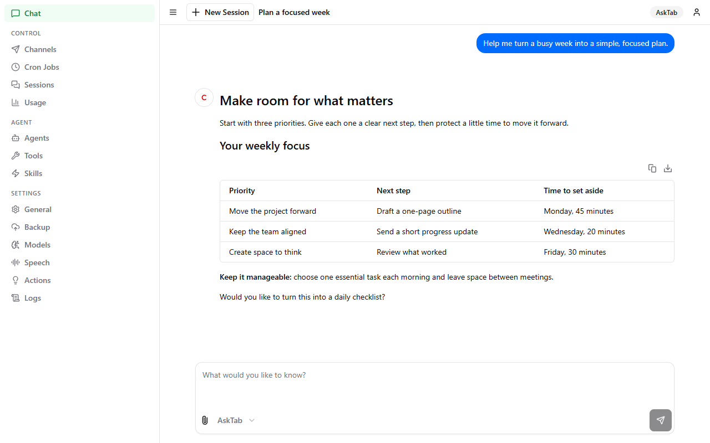

<p align="center">
  
</p>

<h1 align="center">AskTab</h1>

<p align="center"><strong>Your AI, one tab away.</strong></p>

<p align="center">
  Chat, explore ideas, and get things done with an AI assistant that lives in your browser.
</p>

<p align="center">
  <a href="https://hicms.github.io/">Website</a> ·
  <a href="https://github.com/hicms/ask-tab/releases/latest">Download</a> ·
  <a href="docs/index.md">Documentation</a> ·
  <a href="https://hicms.github.io/ask-tab/privacy.html">Privacy policy</a>
</p>



*A real AskTab conversation with illustrative sample content.*

AskTab is an open-source browser extension with a side panel for browsing and a full-page workspace for focused conversations. It brings chat, browser tools, files, and agent settings into one place.

## What you can do

| Capability | Use it to |
| --- | --- |
| AI conversations | Draft, ask questions, and explore ideas with the models available through your AskTab account |
| Browser tools | Read pages and work with browser tasks from the same conversation |
| A flexible workspace | Switch between the browser side panel and a full-page view |
| Organized conversations | Keep chats, files, and agent settings together; archive and restore conversations |
| Additional integrations | Use messaging channels, voice features, and supported on-device model and media components |

**An AskTab account and a reachable AskTab service are required for sign-in and remote AI features.** Available models and integrations depend on the service configuration. Remote model requests go through that service, which manages accounts and upstream credentials; the extension does not ask users to enter upstream model API keys.

## Install in Chrome

1. Download the Chrome ZIP from the [latest release](https://github.com/hicms/ask-tab/releases/latest) and extract it.
2. Open `chrome://extensions` and enable **Developer mode**.
3. Click **Load unpacked** and select the extracted extension folder.
4. Open AskTab, sign in, and select an available model.

Chrome Web Store listing coming soon. For updates, follow the instructions in the [release notes](https://github.com/hicms/ask-tab/releases).

## Build from source

This repository contains the Manifest V3 extension, built with React, TypeScript, Vite, and Turborepo. The separate AskTab service is **not included**.

Requirements: Node.js 22.15.1 or newer, pnpm 10.11.0, and `bash` available for the project scripts.

```bash
pnpm install --frozen-lockfile
```

The install script creates `.env` from `.example.env` when needed. Builds use the production AskTab service (`CEB_ASK_SERVICE_URL_PRODUCTION`, currently `https://ask.vigoai.cn`) unless you choose another target. `CEB_ASK_SERVICE_URL_DEVELOPMENT` and `CEB_ASK_SERVICE_URL_TEST` hold the other two service URLs; both currently use `http://127.0.0.1:37817`, and each can be changed independently. `CEB_ASK_SERVICE_URL_LOCAL` is the address of a local service; when the extension is loaded from files (unpacked), General → Settings lets you switch between it and the built-in AskTab service. Leave it empty to hide that option. Do not commit `.env` or credentials.

```bash
pnpm build
```

On Windows, choose the service environment at build time:

```powershell
.\scripts\build.ps1
.\scripts\build.ps1 -Environment development
.\scripts\build.ps1 -Environment test
.\scripts\build.ps1 -Full
.\scripts\build.ps1 -Environment test -Full
```

By default, `build.ps1` quickly rebuilds only the background script for the production service. Use `-Environment development` or `-Environment test` to select another service. Run `-Full` first for the same environment, after changing page or shared UI code, or when switching environments. Full builds produce a local bundle in `dist/`; they do not publish a release. `pnpm build` uses the production service URL by default; set `CLI_CEB_TARGET` to `development` or `test` to change that.

Open `chrome://extensions`, enable **Developer mode**, choose **Load unpacked**, and select the generated `dist/` directory. Sign in to the AskTab service and select a model in the extension.

For a Firefox build, run `pnpm build:firefox` and load the generated extension through `about:debugging`.

## Development

| Command | Purpose |
|---|---|
| `pnpm dev` | Build and watch the Chrome extension |
| `pnpm build` | Create a production build in `dist/` |
| `pnpm test` | Run unit tests after building workspace packages |
| `pnpm test:e2e` | Run the optional extension startup smoke test after a build |
| `pnpm quality` | Run lint, formatting, type checks, and unit tests |
| `pnpm zip` | Build and create a Chrome ZIP in `dist-zip/` |

### Package or publish a Chrome release

Set the HTTPS origin of the AskTab service that the release should use, then package a tag that matches the versions in the root and `chrome-extension/package.json`:

```powershell
$env:ASKTAB_RELEASE_SERVICE_URL = 'https://asktab.example.com'
pnpm release:package v0.1.1
```

The command builds the Chrome extension and writes `asktab-chrome-v0.1.1.zip` and `asktab-chrome-v0.1.1.sha256` to `dist-zip/`. It checks the built manifest version and restores the local `.env` after packaging. It packages files locally; it does not create a Git tag or GitHub Release.

For an automated GitHub release, set the repository Actions variable `ASKTAB_RELEASE_SERVICE_URL` to the production HTTPS service origin. Commit and push your source changes, then run this from a clean `main` branch:

```powershell
.\scripts\release.ps1 -Publish

# Or choose an explicit version:
.\scripts\release.ps1 -Publish -Version 0.2.0
```

Without `-Version`, the script increments the current `package.json` patch version by one (for example, `0.1.1` becomes `0.1.2`). An explicit version must use `major.minor.patch` and cannot be lower than the current version; it may match an already committed version if the tag is unused. The script verifies that `main` matches `origin/main`, checks the target tag and release configuration, updates the root and Chrome extension package versions, and commits the version change. It pushes `main` and the new tag atomically to trigger the [release workflow](.github/workflows/release.yml), then waits for the workflow and confirms that the GitHub Release contains both the ZIP and checksum. If the push fails, it retains the local commit and tag and prints the push command to retry after resolving the error.

The workflow builds workspace packages before running checks, then builds with the production service URL. A missing service URL stops the workflow before checks. The URL is embedded in the extension; the build does not contact the service, so deploy it before expecting service-backed features to work. Run `.\scripts\release.ps1 -Help` to see its usage.

Release notes use English headings and instructions in two sections: **What's Changed** and **Install / Run**. Changes are generated from commit messages since the highest earlier `vX.Y.Z` tag reachable from the release commit. The first release includes its reachable history. Direct commits are included without requiring pull requests; merge commits and empty-body `Release vX.Y.Z` version commits are omitted. Notes group the original subjects and bodies into features, fixes, improvements, maintenance, and other updates, with commit links and a full comparison link. Conventional Commit prefixes and common leading verbs determine the groups; messages are not rewritten or translated. The installation section includes that version's Chrome ZIP and SHA-256 links, steps to load and use the extension, upgrade instructions, and version-pinned build documentation. The workflow fetches full history and tags before generating notes. To preview notes locally after fetching all history and tags:

```powershell
node scripts/generate-release-notes.mjs v0.1.2 "$env:TEMP/asktab-v0.1.2-notes.md"
```

Optional [Chrome Web Store upload setup](docs/development/webstore-upload.md) adds an automatic draft upload after each GitHub release. It requires a one-time store item and service-account setup, and stays disabled until configured. Uploading does not submit the extension for review or publish it to users.

## Project structure

| Directory | Contents |
| --- | --- |
| `chrome-extension/` | Background worker, manifest, and runtime assets |
| `pages/` | Extension views |
| `packages/` | Shared modules and UI |
| `tests/` | Integration and end-to-end coverage |
| `scripts/` | Build, release, and asset management tools |
| `assets/` | Shared public images, provenance, and the asset manifest |
| `docs/` | Installation, development, and feature documentation |

See [installation](docs/start/installation.md), [development](docs/development/index.md), and the [documentation index](docs/index.md) for details.

## Website and public assets

The [AskTab website](https://hicms.github.io/) is maintained in [hicms/hicms.github.io](https://github.com/hicms/hicms.github.io). Public screenshots and promotional images are managed here through [assets/manifest.json](assets/manifest.json). The README uses these source files directly; the website receives selected copies through the sync script.

```powershell
node scripts/sync-site-assets.mjs ../hicms.github.io
node scripts/sync-site-assets.mjs ../hicms.github.io --check
```

See the [asset management guide](assets/README.md) for dimensions, source ownership, and the update workflow. This keeps the website, README, and Chrome Web Store materials consistent.

## Data and permissions

Chat history and settings are stored in the browser. Remote AI requests and optional account backups use the configured AskTab service. Browser automation, messaging channels, and Google integrations use additional browser permissions; the requested permissions are declared in [`chrome-extension/manifest.ts`](chrome-extension/manifest.ts). Read the [privacy policy](https://hicms.github.io/ask-tab/privacy.html) for processing, retention, service providers, and data controls. Review the permissions and data flows before distributing a build.

## License

AskTab is licensed under the [MIT License](LICENSE). Notices for bundled third-party code are in [THIRD_PARTY_LICENSES](THIRD_PARTY_LICENSES).
